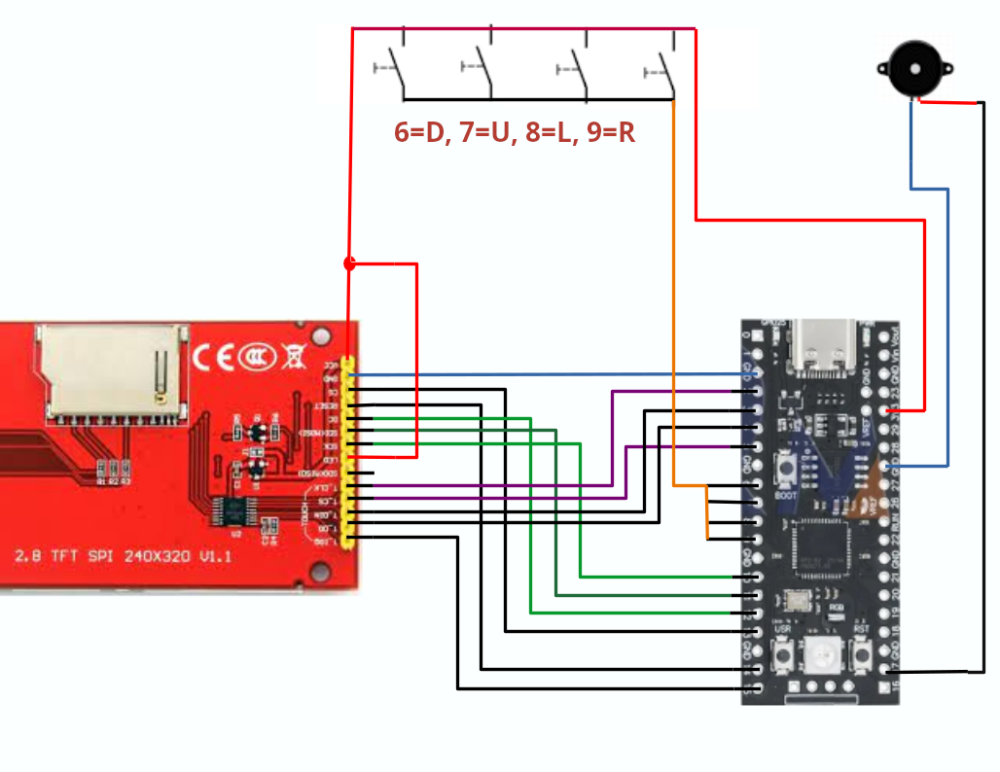

# spiele\

Tetris, Klotski und Snake für ili9341, passiv-Buzzer und vier Tastern\
auf../libs aufbauend\
Spiele benoigt Grafikdateien die aufgrund ihrer Groesse nicht simpel mit einem Programm in den Flash geschrieben werden koennen.\
Es muessen nacheinander vier Programme auf den Pico kopiert werden um alle Daten auf den Flash des Pico zu bekommen \
Kopieren sie per dag und drop nacheinander \
mit flash_spiele0.uf2 beginnend \
dann flash_spiele1.uf2 \
dann flash_spiele3.uf2 \
und spiele.uf2 endend auf den Pico um Tetris, Klotski und Snake auf dem Pico spielen zu koennen.\

Zum selbskompilieren:
Die Datei "yd_rp2040.h" ist eine Board-Spezifikationsdatei für dieses Program
und sollte nach pico-sdk/src/boards/include/boards/ kopiert werden, \
ansonsten sind alle "CMakeLists.txt" Dateien anzupassen.
